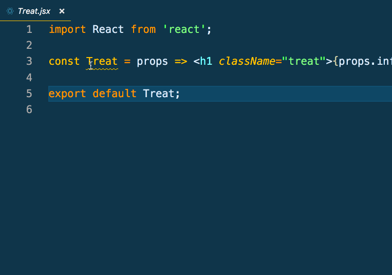
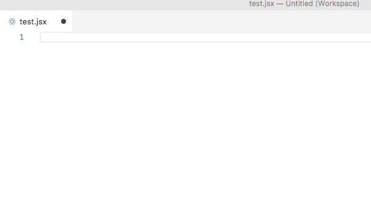
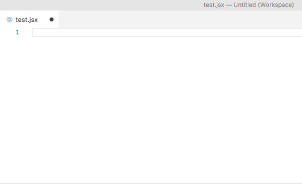
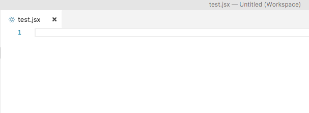

# ReactEd


An extension to assist with development of react and redux applications.

## Features

* When you hover over the component name you will see which props are being passed from the state down to the current component.
* React/Redux Snippets for ease of development

## Usages

### Prop-Drilling


### Snippets
#### ccon

#### cdmount

#### cocomp

#### cwmount

#### impf

#### ireact

#### ired

#### reducer

#### rstore

#### scribe

#### tsps


## Configuration

ReactEd requires a webpack generated bundle file to properly traverse your application.  At this time we are unable to offer support for `Create-React-App`. Files need to be refreshed by closing and reopening the file to update the props information.
```javascript
{
  module.exports = {
    entry: './src/index.js',
    output: {
      path: path.resolve(__dirname, 'dist/'),
      filename: 'bundle.js',
      publicPath: '/dist',
    },
    mode: 'none',
  }
}
```
**Note:** If using Webpack 4.0 or greater please change your [**mode**](https://webpack.js.org/concepts/#mode) to **none** as the default is `Production` which will minify the bundle and make our tool stop working.

## Change Log
See Change Log [here](CHANGELOG.md)

## Issues
Submit the [issues](https://github.com/ReactEdLLC/ReactEd/issues) if you find any bug or have any suggestion.

## Contribution
Fork the [repo](https://github.com/ReactEdLLC/ReactEd) and submit pull requests.